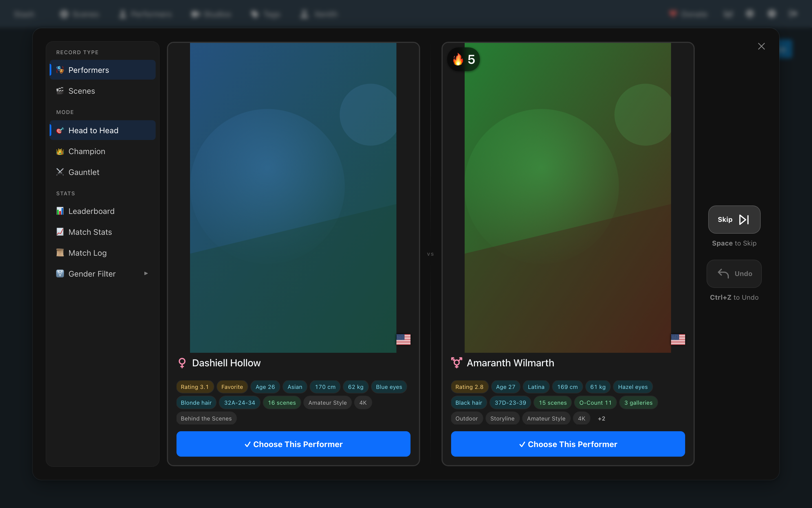
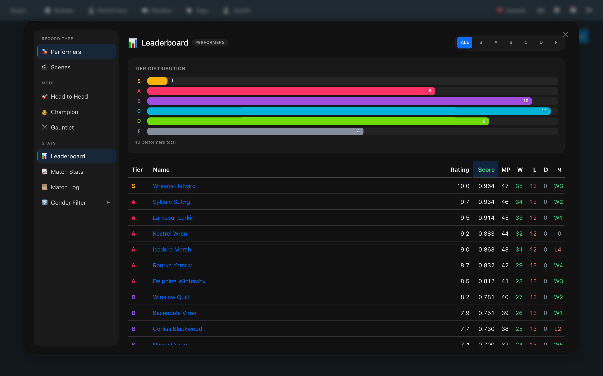
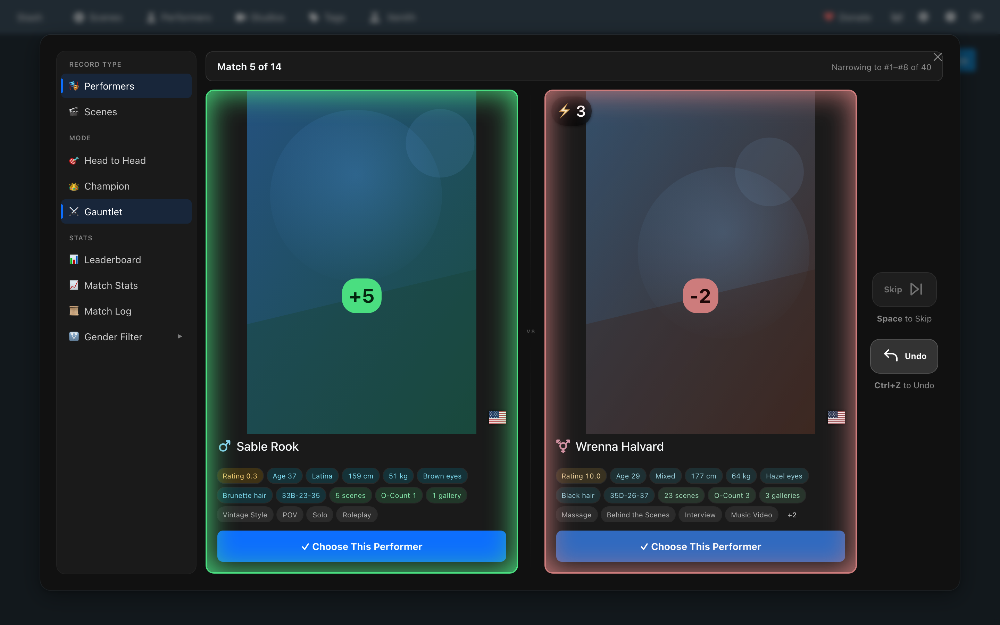
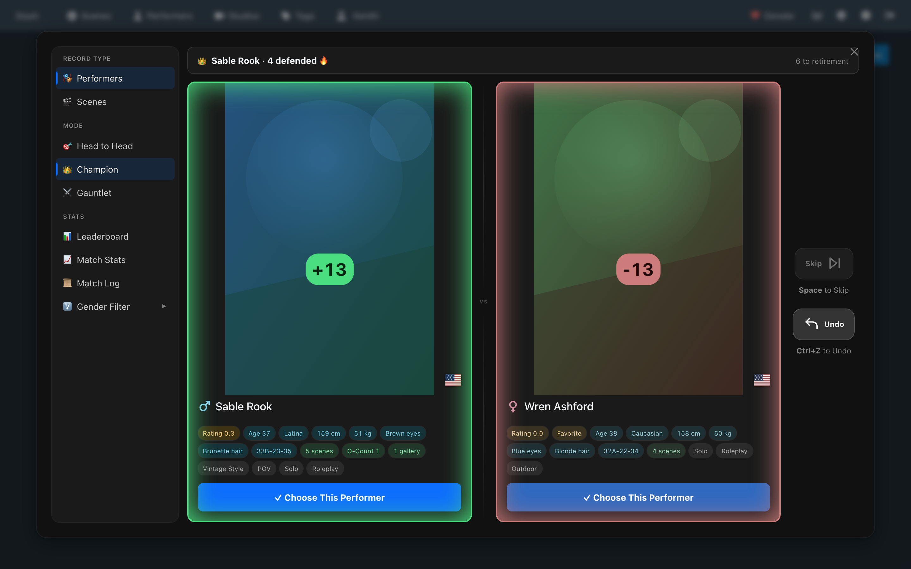
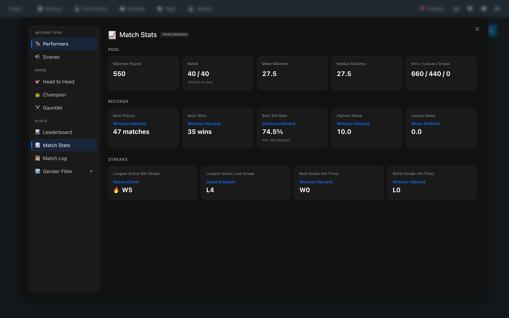
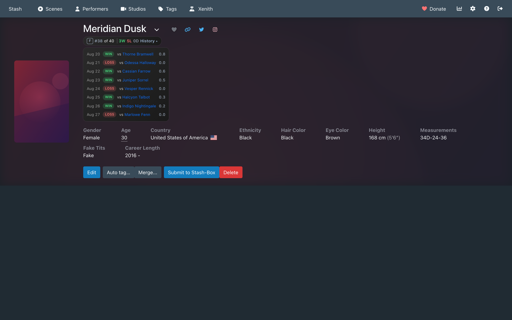
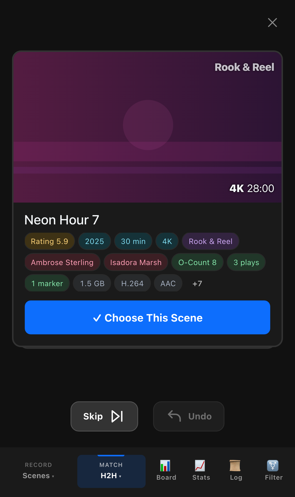
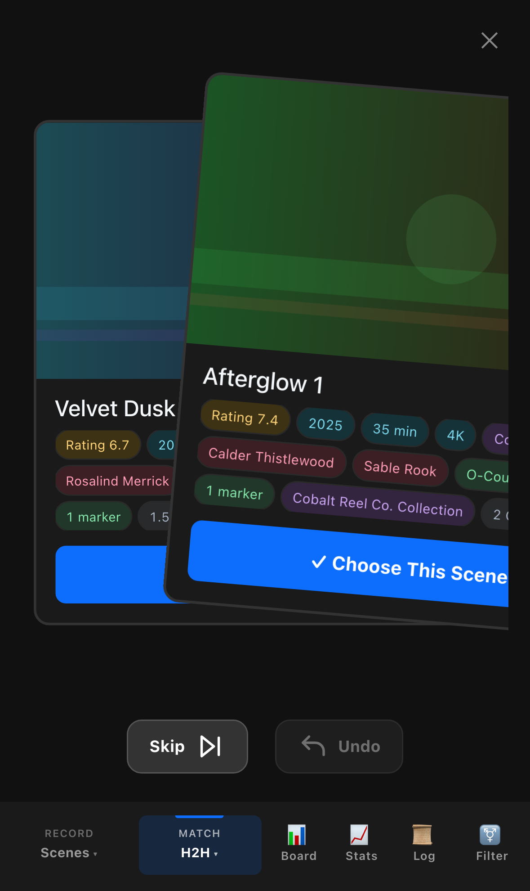

# Xenith

Elo-based head-to-head ranking and leaderboard plugin for Stash. Pick winners in matchups between performers or scenes; ratings settle into six tiers (S through F).

Requires Stash v0.31+.

## Features

- **Head-to-Head** — performers and scenes share one matchmaking pipeline that favors the most informative pairing, with a boost for items with few matches. Keyboard shortcuts: arrows to choose, space to skip, Ctrl+Z to undo (double-tap ↑/↓ also work as undo/skip)
- **Gauntlet mode** — place one challenger against the ladder in a short run of matches; a Bayesian posterior converges on its rank
- **Champion mode** — an incumbent defends its spot against a stream of challengers until it loses or hits the reign cap
- **Leaderboard** — sortable, filterable by tier, paginated, with display rating alongside raw rating. Performers and scenes
- **Match Stats** — pool-wide records (best streaks, most matches, etc.) for performers and scenes
- **Match Log** — every match played this session, performers and scenes
- **Battle rank badges** — on performer and scene detail pages and cards, showing rank, W/L and streak; the detail-page badge expands into a history drawer (last 10 matches, opponent links, rating changes)
- **Performer thumbnail tooltips** — hover any performer's image (including on scene pages) to see their rank
- **Curated metadata chips** — head-to-head and Gauntlet-preview cards show a fixed-size row of chips (age, height/weight, tags, etc. for performers; resolution, duration, tags, etc. for scenes), each hideable via a setting
- **Sidebar nav toggle** — switch battle type, match mode and view without leaving the modal

Snapshot export/import for backing up and restoring rating history is a maintenance task (see below).

## Screenshots

All screenshots use generated placeholder art and invented names; no real library content.

<p>
  
  
</p>
<p>
  
  
</p>
<p>
  
  
</p>
<p>
  
  
</p>

## Installation

**Prerequisite, all paths:** Xenith's backend needs `stashapp-tools`. Stash doesn't install Python deps for you, so run `pip install -r requirements.txt` (or `pip install stashapp-tools`) once, regardless of which install method you use below.

### A. In-app (recommended)

1. Settings → Plugins → Available Plugins → Add Source, and add one of:
   - `https://gq1869.github.io/stashapp-xenith/stable/index.yml` — latest release (recommended)
   - `https://gq1869.github.io/stashapp-xenith/canary/index.yml` — latest `main`, unreleased, may break

   Add only one — both channels share the same plugin id, so Stash won't show a source's plugin as installable while the other channel's build is already installed. **To switch channels: uninstall the current build first** (Settings → Plugins → Installed Plugins → Uninstall), then the other source's row will appear under Available Plugins to install. Ratings and match history live in Stash's database, so switching loses nothing. A canary build is labelled as such in the Xenith modal and in Settings → Plugins.
2. Find Xenith under Available Plugins and click Install — this installs a prebuilt bundle into your Stash `plugins/` directory, with no build step
3. Install backend deps (see prerequisite above)
4. Future updates show up in the same Available Plugins list

### B. Release zip

1. Download `xenith.zip` from this repo's Releases page (ships a prebuilt `dist/`) and unzip it into your Stash `plugins/` directory
2. Install backend deps (see prerequisite above)
3. Reload plugins in Stash (Settings → Plugins → Reload Plugins)

### C. Clone + build (development)

1. Clone this repo into your Stash `plugins/` directory
2. Install backend deps (see prerequisite above)
3. `npm install && npm run build` — `dist/` is gitignored, so this step is required when cloning
4. Reload plugins in Stash (Settings → Plugins → Reload Plugins)

## Usage

Click the Xenith button in the nav bar to open the ranking modal. Choose a battle type (Performers or Scenes) from the sidebar, then start comparing. Ratings update the moment you pick a winner. See [`XENITH.md`](XENITH.md) for how the math works.

### Maintenance tasks (Settings → Tasks → Xenith)

- **Wipe Match History** — clears Xenith custom fields on performers and scenes, keeps ratings. Also available as performers-only/scenes-only variants
- **Reset Ratings** — nulls all performer and scene ratings. Also available as performers-only/scenes-only variants
- **Export Snapshot** — writes a timestamped JSON snapshot of ratings + history to `snapshots/`
- **Import Latest Snapshot** — restores from the most recent snapshot file. Performers are matched by name (unmatched or ambiguous names are skipped); scenes are only imported if the snapshot's `database_path` matches the current Stash database, since scene IDs aren't stable across databases
- **Migrate Legacy Field Names** — one-time migration from the original HotOrNot-era custom-field names to Xenith's own; safe to re-run, takes its own pre-migration snapshot first

## Settings

- **Hide Xenith Rank Badge** — suppresses the rank badge on performer/scene pages/cards, restores default Stash rating display
- **Leaderboard Rows Per Page (Mobile)** — rows per leaderboard page on mobile; desktop always renders 5x this value. Leave at 0 for automatic sizing
- **Use Customary Units** — show height/weight in feet/inches and pounds instead of centimeters/kilograms. Off by default
- **Hidden Performer Card Chips** — comma-separated list of h2h performer card chips to hide (e.g. `measurements, piercings`); blank shows all
- **Hidden Scene Card Chips** — comma-separated list of h2h scene card chips to hide (e.g. `video_codec, bit_rate`); blank shows all

`XENITH_STASH_API_KEY` — not a plugin setting, an optional environment variable for the Stash server/container. Only needed on an auth-enabled Stash instance whose session cookie goes stale; when set, Xenith's maintenance tasks send it alongside the cookie so a stale cookie doesn't hard-fail the task.

## Development

Stack: React 17.0.2 (legacy API via `window.PluginApi.React`/`ReactDOM`), Vite, Python backend on `stashapi.stashapp.StashInterface`.

```
npm run build   # bundle src/main.js -> dist/xenith.js
npm run watch   # rebuild on change
```

Frontend entry is `src/main.js`; components live in `src/components/`. Backend entry is `backend/main.py`, tasks in `backend/tasks.py`. `src/elo.js` is the single source of truth for rating math — don't re-derive K-factor or display rating elsewhere.

## Acknowledgments

Xenith started as a fork of [Ascension](https://github.com/Servbot91/Sakotos-Stash-Repo/tree/main/plugins/Ascension) v1.2.6, then diverged: I rewrote the rating engine and the interface. Ascension itself builds on an earlier family of Elo/head-to-head plugins for Stash, which Xenith also owes a debt to:

- [Stash Battle](https://github.com/dtt-git/stash-battle/tree/main/plugins/stash-battle)
- [HotOrNot](https://github.com/lowgrade12/hot-or-not/tree/main/plugins/hotornot)
- [HotOrNotV2](https://github.com/lowgrade12/hot-or-not/tree/main/plugins/hotOrNotV2)
- [HotOrNot_V3](https://github.com/Lurking987/stash-plugins/tree/main/plugins/hot_or_not)
- [Ascension](https://github.com/Servbot91/Sakotos-Stash-Repo/tree/main/plugins/Ascension) ([white paper](https://github.com/Servbot91/Sakotos-Stash-Repo/blob/main/plugins/Ascension/Documentation/White%20Paper.md)), the direct fork source

`NOTICE` lists what carried over from Ascension v1.2.6; [`docs/rating-differences.md`](docs/rating-differences.md) covers what changed and why.

## License

GPL-3.0 — see LICENSE.
